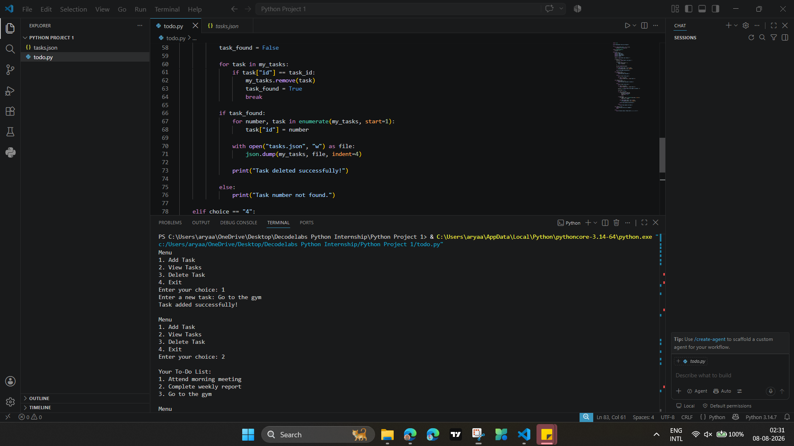
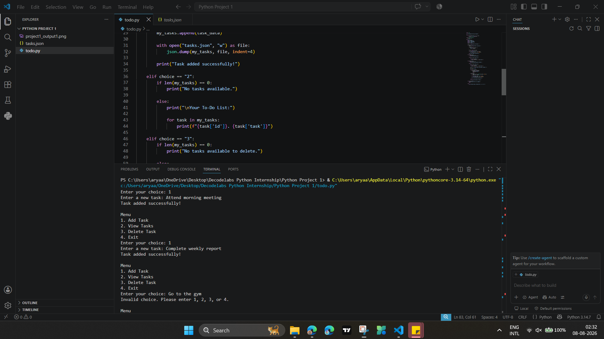

# Project 1 - To-Do List Application

## DecodeLabs Python Programming Internship

This project is a command-line To-Do List application developed using Python as part of the DecodeLabs Python Programming Internship.

The application allows users to add, view, and delete tasks. Tasks are stored in a JSON file so that they remain saved even after the program is closed and restarted.

## Features

- Add new tasks
- View all saved tasks
- Delete tasks that are no longer needed
- Automatically assign task numbers
- Automatically reassign task numbers after deletion
- Save tasks permanently using a JSON file
- Load saved tasks when the program is restarted
- Handle invalid menu choices
- Exit the application safely

## Technologies Used

- Python
- JSON
- Visual Studio Code
- GitHub

## Project Files

- `todo.py` - Main Python program
- `tasks.json` - Stores the saved To-Do List tasks
- `project1_output1.png` - Project output screenshot
- `project1_output2.png` - Project output screenshot
- `README.md` - Project documentation

## How the Application Works

When the program starts, the user is presented with the following menu:

1. Add Task
2. View Tasks
3. Delete Task
4. Exit

### Add Task

The user can enter a new task, and the application automatically assigns a task number and saves it to the JSON file.

### View Tasks

The application displays all currently saved tasks along with their task numbers.

### Delete Task

The user can enter the task number of a task that is no longer needed. The selected task is deleted, and the remaining tasks are automatically renumbered.

### Data Storage

Tasks are stored in `tasks.json`. This allows the application to retain saved tasks even after the Python program is closed and restarted.

## Project Output

### Application Demo

### Task Management Demo

## What I Learned

Through this project, I learned and practiced:

- Python variables and user input
- Conditional statements
- Loops
- Lists and dictionaries
- Working with JSON data
- Reading data from files
- Writing data to files
- Task ID management
- Basic error and invalid-input handling
- Building a command-line application
- Organizing and documenting a Python project on GitHub

## Internship

**Organization:** DecodeLabs  
**Domain:** Python Programming  
**Project:** Project 1 - To-Do List Application

---

Developed as part of the DecodeLabs Python Programming Internship.
